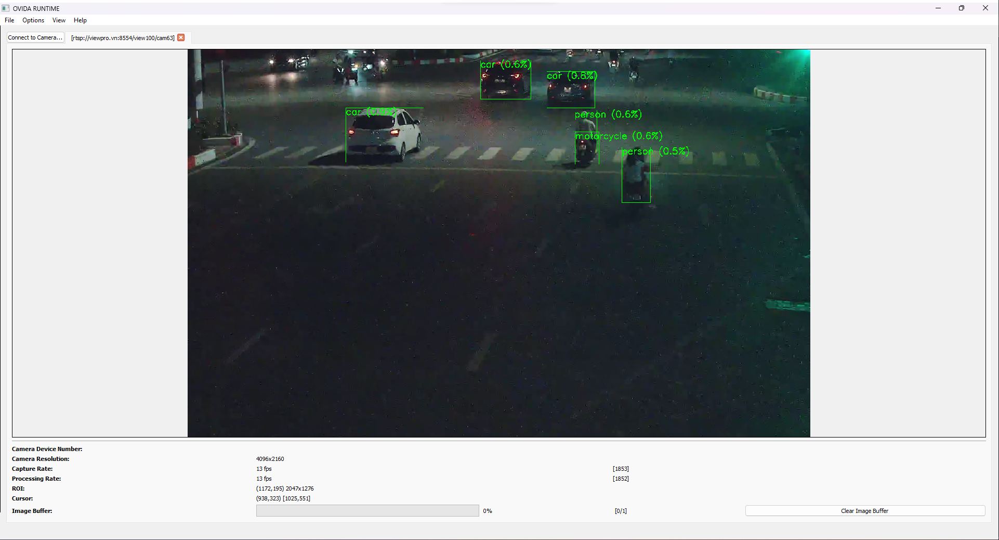

# OVIDA Edge AI Video Analytics for any hardware.


# Layer Architecture


# Show case
## Connect 


## Camera view


## Detector


## Tracker


## Analysis setup

# Introducing  OVIDA-RT.
OVIDA-RT is our AI software stack that comes pre-installed with dozens of video analytics and computer vision solutions. It's easy to configure and customize to your use-case, even if you're not a data scientist or developer.

# All of our solutions for one price
For a single low price you have access to all of our AI solutions now, and in the future.

# Deployment options for OVIDA's algorithms.
OVIDA provides many deployment options for our computer vision algorithms, including hardware, cloud, and docker. Work with us to define your ideal outcomes, and our solutions team will provide a full package, ready for release or integration.

## Windows
### Visual Studio 2013
#### Environment
The build procedure has been tested and verified using:  
- Windows 7 Ultimate Service Pack 1 64-bit
- Visual Studio 2013 Ultimate Update 5  
- CMake 3.2.3: http://www.cmake.org/download/  
- OpenCV 3.0.0: http://opencv.org/downloads.html  
- Qt 5.5.0 (msvc2013_64): http://www.qt.io/download/

#### Preparation
Firstly, ensure the following are added to the Windows ```PATH``` variable (modified as required):  
- CMake executable: ```C:/Program Files (x86)/CMake/bin```  
- Qt libraries (DLLs): ```C:/Qt/Qt5.5.0/5.5/msvc2013_64/bin```  
- OpenCV libraries (DLLs): ```C:/Users/Nick/Desktop/opencv/build/x64/vc12```
